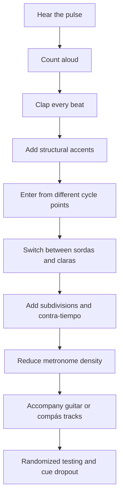
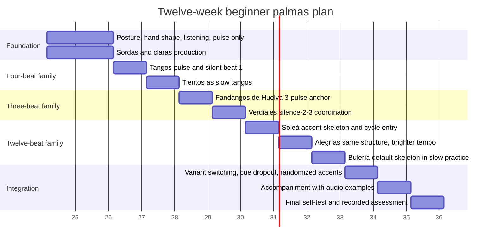

# Flamenco Palmas for Beginners and Design Implications for a Clap App

## Executive Summary

Palmas are not an ornamental extra in flamenco. They are a core timing instrument: they mark pulse, articulate accents, cue entries, stabilize ensemble timing, and shape the feel of compás. Any serious Clap App should therefore treat palmas as a rhythmic language, not as generic “clap on the beat” training. Official Andalusian educational materials define palmas as a form of accompaniment that carries the *son* of the cante or baile, while the broader flamenco tradition organizes repertoire into *palos* distinguished by characteristic compás, phrasing, and affect. Flamenco itself is officially recognized in Andalusia and by UNESCO as living intangible heritage transmitted orally in families, peñas, tablaos, academies, and other social settings. citeturn39view2turn39view1turn26search1turn26search2

For a beginner app, the highest-value design decision is to separate three layers that are often muddled together in teaching materials: the **metric skeleton** of the palo, the **surface palmas pattern**, and the **performance context**. The metric skeleton is relatively stable: for example, the 12-pulse mixed compás family centers on accents commonly taught as 3, 6, 8, 10, and 12; tangos/tientos use a 4-beat frame with a characteristic silent or unmarked beat 1 in many teaching traditions; Fandangos de Huelva and verdiales rest on 3/4-derived patterns. Surface patterns vary by school, tempo, and whether palmas are supporting cante, baile, or a compás-only practice loop. A good app should therefore present a canonical “accent map” first and only then add pattern variants. citeturn37view0turn38view0turn38view1turn40view0turn38view2turn38view3turn10search2turn33search1turn34search0

The most defensible beginner progression is also the least glamorous: count aloud, clap the pulse, exaggerate accents, enter the cycle from different starting points, and only then move to faster palos or syncopated contra-tiempo patterns. The Andalusian pedagogical materials are unusually clear on this: teach the cycle slowly, count the accented beats, practice multiple repetitions, mark the compás with palmas or feet, then accompany recorded guitar, and only afterwards move across related palos by changing speed and feel. In plain terms: do not let the app seduce users into bulerías before they can survive soleá and tangos without a rhythmic face-plant. citeturn37view0turn12search0

From an engineering perspective, clap recognition should use a hybrid architecture: a deterministic onset front end for low-latency transient detection, a meter-aware tracker that knows the target compás in advance, and a scoring layer that grades users against both onset timing and cycle position. This is stronger than unconstrained beat tracking because the app already knows the expected metrical grid. Real-time onset-detection literature and beat-tracking literature both support this decomposition: detect onsets, estimate tempo/phase, maintain contextual continuity, and evaluate with explicit timing windows. citeturn16view3turn17view0turn22academia45turn13academia52turn36search0turn15search0

The practical product target is a system that begins with **all-pulse guidance**, graduates to **accent-only guidance**, then to **sparse cueing**, and eventually to **cue dropout** and **randomized accent tests**. Audio should remain the primary timekeeper; haptic cues are useful and can maintain tempo, but current evidence still favors auditory cues for finer synchronization. Visuals should reinforce structure and error location, not replace the ear. If visuals are over-specified, users can become graph readers rather than compás keepers, which is the rhythm equivalent of mistaking the menu for dinner. citeturn35search1turn35academia25turn35search0turn14search1turn14search2

## Flamenco Theory and Terminology

Flamenco is formally described by the Junta de Andalucía as a plural artistic and cultural expression rooted in Andalusian identity, with the Roma people and historical intercultural influence playing a major role in its origin and evolution. Its transmission is oral and social as well as institutional, occurring in families, artistic lineages, peñas, tablaos, academies, conservatories, and universities. UNESCO placed flamenco on the Representative List of the Intangible Cultural Heritage of Humanity on November 16, 2010. That matters for product design: a Clap App should teach not just timekeeping, but also the oral-social logic of listening, call-and-response, and ensemble entry. citeturn26search1turn26search2

Official Andalusian flamenco vocabulary defines **palmas** as a way of accompanying cante; it lists multiple types, including *sordas*, *redoblás*, and *naturales*, and defines **palo** as the name given to each style of cante. The same glossary identifies *soleá* and *bulerías* as *compás mixto* forms, *tangos* as 4/4, and *tientos* as sharing the tangos compás but at a slower tempo. In English-language teaching, the most common beginner contrast is **palmas sordas** versus **palmas claras**: *sordas* are muffled, cupped-hand claps used to support singing or quieter passages; *claras* are brighter, more penetrating claps produced by striking fingers into the palm. The terminology is not perfectly standardized across sources, so the app should expose this as a terminology map rather than pretending there is only one accepted pair of labels. citeturn39view2turn39view0turn25search0turn30youtube25

The core rhythmic term is **compás**. In the mixed 12-pulse family, Andalusian educational sources describe a twelve-time compás formed by alternating binary and ternary groupings, and they teach the accented positions as 3, 6, 8, 10, and 12 when the cycle is understood in practical flamenco counting. The same material explicitly notes the common flamenco practice of re-counting beats 11 and 12 as 1 and 2, which is why beginners so often get lost: they are trying to memorize one linear count while performers are feeling another cyclical one. A good app should therefore present both views side by side: **linear pulse view** and **performance cycle view**. citeturn37view0turn38view0

Historically, the Andalusian materials trace **soleá** to dance accompaniment from the early nineteenth century and describe **bulerías** as arising from an “aligeramiento” or quickening/lightening of soleá, appearing by the mid-nineteenth century. They describe **Fandangos de Huelva** as a folkloric form that became flamenco in a particular regional setting, while **verdiales** represent an older, popular branch of the Málaga fandango family. Those official descriptions line up well with Bernat Jiménez de Cisneros’s musicological work, which treats palmas as both musical language and cultural expression and analyzes the metrical structure of flamenco through pulse levels and metric matrices. That body of work supports an app architecture organized by **metrical family first, palo second, pattern third**. citeturn38view0turn38view1turn38view2turn38view3turn6search8turn6search9

## Core Compás Patterns for Beginner App Design

The app should begin with **reference compás maps**, not with full ornamental patterns. The table below distinguishes the **canonical beginner accent skeleton** from the more variable surface pattern. Tempo ranges are presented as **app-oriented practice ranges**, synthesized from official descriptions and high-quality flamenco metronome/tutorial resources rather than as rigid claims about every real performance. Flamenco is oral art, not spreadsheet worship. Still, product design needs numbers, so here are useful ones. citeturn38view0turn38view1turn40view0turn38view2turn38view3turn33search3turn10search2turn33search1turn34search0turn33search2

| Palo | Metric frame | Beginner accent skeleton | Subdivision view for app | Suggested app tempo bands | Beginner exercise focus |
|---|---|---|---|---|---|
| **Soleá** | 12 pulses, mixed compás | 12, 3, 6, 8, 10 | Show both `12 1 2 3 4 5 6 7 8 9 10 11` and linear `1–12`; default quarter-pulse with optional 8th-note subdivision | Start 60–80 BPM; develop 80–100; upper practice 100–120 citeturn38view0turn33search3turn9youtube55 | Accent stability, cycle entry, not “adding 13” |
| **Bulería** | 12 pulses, same family as soleá, faster | 12, 3, 6, 8, 10 as default; offer variant 12, 3, 7, 8, 10 | Default 12-pulse display; optional 6-pulse grouping mode | Start 140–160 for analysis; develop 160–190; advanced 190–230+ citeturn38view1turn10search2turn10search4turn10youtube46turn10youtube47turn9search0 | Half-compás feel, 6-pulse grouping, remate placement |
| **Alegrías** | 12 pulses, cantiñas family | 12, 3, 6, 8, 10; start option on 1 or 12 | Offer start-on-1 and start-on-12 modes | Start 100–120; develop 120–150; upper practice 150–170 citeturn38view4turn29search0turn29search2turn9search45 | Same 12-beat architecture as soleá, but lighter, brighter feel |
| **Tangos** | 4/4 | silent 1, then 2–3–4 marked | 4-pulse view with optional 8-beat phrase grouping | Start 80–110; develop 110–140; upper practice 140–200 citeturn40view0turn33search1turn33youtube34turn33youtube39 | Prevent phase shift onto beat 2; phrase in 8s |
| **Tientos** | Same compás as tangos, slower | same accent map as tangos | 4-pulse view, slower scroll and stronger sustain cues | Start 60–80; develop 80–100; upper practice 100–120 citeturn40view1turn33search2 | Patience, long phrases, anti-rush control |
| **Fandangos de Huelva** | 3/4 core; often phrased in 6 or 12 in practice | beat 1 strong | 3-pulse default, optional 6- and 12-pulse overlay | Start 80–100; develop 100–132; upper practice 132–154+ citeturn38view2turn34search0turn34youtube21turn33youtube39 | Feeling 1 as anchor while tolerating phrase extensions |
| **Verdiales / abandolaos** | 3/4 | silence–2–3 | 3-pulse view with foot marker on silent 1 | Start 100–120; develop 120–140; faster traditional variants above that citeturn38view3 | Silent downbeat awareness and foot-plus-clap coordination |

A beginner-facing app also needs a **notation convention** that is simpler than staff notation but richer than flashing circles. A practical text notation system is:

- `X` = accented clap, usually clearer/brighter
- `x` = unaccented clap, usually softer/more contained
- `.` = rest or silent beat
- `>` = optional visual accent marker
- `&` = offbeat subdivision

Using that notation, the app can display **reference skeletons** like these:

```text
SOLEÁ / ALEGRÍAS accent skeleton
12  1  2  3  4  5  6  7  8  9 10 11
 X  .  .  X  .  .  X  .  X  .  X  .

BULERÍA default beginner skeleton
12  1  2  3  4  5  6  7  8  9 10 11
 X  .  .  X  .  .  X  .  X  .  X  .

BULERÍA variant skeleton
12  1  2  3  4  5  6  7  8  9 10 11
 X  .  .  X  .  .  .  X  X  .  X  .

TANGOS
1  2  3  4
 .  X  x  X

TIENTOS
1  2  3  4
 .  X  x  X

FANDANGOS DE HUELVA
1  2  3
 X  x  x

VERDIALES
1  2  3
 .  X  X
```

Those are **teaching skeletons**, not claims that every professional palmero would clap exactly that pattern in performance. Bulerías especially should expose multiple valid groupings, including 12-pulse and 6-pulse views. Ravenna Flamenco explicitly notes the common traditional 12-3-6-8-10 pattern and a modern variant shifting the second-half accent from 6 to 7, while several teaching resources emphasize that alegrías and soleá share the same broad 12-beat architecture even when phrase starts differ. citeturn10search2turn29search2turn29search0turn30youtube30turn25search0

For app UI, this suggests a **three-layer display**:

1. **Pulse lane**: every beat or subdivision.
2. **Accent lane**: structural accents only.
3. **Variant lane**: optional surface palmas pattern.

That structure teaches users *what must stay fixed* and *what may flex*. It is the difference between building compás and building confusion with excellent animation. citeturn37view0turn6search5turn6search9

## Beginner Pedagogy and Twelve-Week Progression

The strongest beginner pedagogy in the official Andalusian materials is sequential and embodied: write the cycle, count the cycle slowly, exaggerate the strong beats, repeat several cycles in a row, clap or stomp the cycle, then accompany recordings, then vary entry points and speed. The same materials recommend moving across related palos by leveraging shared compás structures and only later introducing faster or more subtle variants. That is exactly how the app should scaffold difficulty. Do not start with bulerías fireworks. Start with compás literacy. citeturn37view0turn12search0

A good practice curriculum should move through five phases: **pulse**, **accent**, **cycle entry**, **surface variation**, and **contextual accompaniment**. Official materials also recommend “entering” the compás at different moments, recognizing cycle beginnings and endings in audio, and practicing the same compás at different speeds. These are not minor exercises. They are the difference between someone who can clap with the screen and someone who can actually accompany a singer without becoming a cautionary tale. citeturn12search0turn37view0

### Practice progression flow



### Suggested beginner drill sequence

| Drill | What the user does | Success criterion | Common failure |
|---|---|---|---|
| Pulse-only loop | Clap every beat for 8 cycles | Inter-onset intervals stable | Accelerating without noticing |
| Accent map | Clap only structural accents while hearing all beats | Accents land in the correct cycle position | Flattening all beats to equal weight |
| Silent-beat awareness | In tangos/verdiales, foot or haptic mark on silent 1, clap the marked beats | No phase shift after 16 bars | Treating beat 2 as beat 1 |
| Entry-point drill | Start on a prompted beat such as 8, 10, or 12 | Correct cycle alignment from arbitrary entry | Good claps, wrong cycle |
| Variant switch | Alternate bulería 6-accent and 7-accent variants | Keep pulse while changing accent map | Losing the half-compás feel |
| Cue dropout | Audio cues disappear for 2–4 cycles, then return | User re-enters still in phase | Drifting ahead or behind during silence |

The most common beginner mistakes are strongly implied by the sources and by the structure of flamenco metronomes: rushing repeated cycles, losing the cycle start, over-focusing on counting instead of hearing phrase shape, shifting tangos one beat out of phase because beat 1 is silent, and mistaking the accent skeleton for the full musical pattern. Ravenna’s soleá and tango metronomes explicitly warn about losing track of “one” and starting on the wrong beat; the Andalusian pedagogical materials explicitly warn teachers to prevent students from accelerating and to train recognition of cycle starts and endings. citeturn33search3turn33search1turn37view0

### Twelve-week learning plan



A practical weekly structure for the app is: **two technique sessions**, **two compás sessions**, and **one accompaniment session**. The user should not unlock denser patterns merely by logging time; they should unlock them after passing cycle-alignment benchmarks. Rhythm apps often reward endurance when they should reward phase accuracy. That is a metrical misdemeanor. The scoring section below proposes how to do this cleanly. citeturn37view0turn36search0turn15search0

## Metronome and Learning UX Design

A flamenco metronome should not behave like a generic classical metronome with a skin of polka dots and faux-Andalusian typography. It should know the palo’s cycle structure, accent map, likely phrase starts, and common alternative groupings. Flamenco Explained’s metronome explicitly supports multiple palos and even allows certain 12-beat palos to start on the upbeat to 7; Ravenna’s metronomes encode palo-specific accent maps and phrase logic for soleá, bulería, tango, and fandangos de Huelva. The design lesson is clear: the metronome is not a neutral BPM machine. It is a compás tutor. citeturn33search2turn33search3turn10search2turn33search1turn34search0

The most effective **click-placement strategy** is progressive sparsity:

| Mode | Audio cue design | Best use |
|---|---|---|
| Full pulse | Every beat audible, structural accents brighter/louder | Absolute beginners |
| Subdivided pulse | Beat plus eighths or quarter-subdivisions | Tightening hand placement and contra-tiempo |
| Accent only | Only structural strong beats audible | Mid-stage cycle stabilization |
| Anchor only | Only 12, or only selected anchor beats, audible | Advanced internalization |
| Cue dropout | Guided silence for 1–4 cycles | Retention and recovery |
| Randomized accent test | User must identify or produce prompted accents | Assessment and anti-autopilot training |

For **tempo ramping**, the safest design is **micro-ramping** rather than dramatic jumps: for example, +2 to +4 BPM after two clean cycles at beginner levels, or +5 BPM only after a full minute above threshold. Because official pedagogy explicitly recommends practicing the same compás at different speeds, and because soleá, bulería, and tangos each admit wide tempo variation by context, the app should store progress by **palo, variant, and cue density**, not only by BPM. One user may manage soleá at 90 BPM with all beats sounded yet fail at 70 BPM with sparse cues; that is not a bug in the user. That is the curriculum doing its job. citeturn12search0turn37view0turn33search2

The **audio/visual cue system** should follow three principles. First, audio remains primary; haptics and visuals are supporting modalities. Second, visuals should show **cycle position** and **error direction**, not a decorative light show. Third, the UI should teach users to hear less, not need more. A strong design pattern is a scrolling circular or looped timeline with fixed accent anchors and moving user onsets, combined with a simple early/late indicator. Real-time visual-feedback research found that visual feedback helped imitation of loudness patterns more than timing patterns, which is a warning against over-trusting visuals for rhythm learning. Meanwhile, haptic metronome research shows tactile cues can still maintain tempo effectively, even if auditory cues remain stronger for reducing asynchrony. citeturn35search0turn35search1turn21search3

For **haptic feedback**, use it as an accent or anchor reinforcement, not as the only pulse stream unless accessibility or environmental constraints require it. A clean implementation is: low-intensity buzz for ordinary beats, stronger buzz for structural accents, and a distinct double pulse for cycle resets. Because audio-haptic asynchrony becomes perceptible outside a relatively broad range and because complex audiovisual events can show synchrony sensitivity around 20 ms with natural-motion JNDs around 60 ms, design targets should be tighter than what perception barely tolerates. A practical product target is **audio-visual sync within 20 ms** wherever possible, **never beyond about 60 ms** in normal operation, and **audio-haptic sync within roughly 30 ms** as a design target even though broader mismatches may still be tolerated. These figures are best understood as engineering targets inferred from perception research, not as uniquely flamenco numbers. citeturn14search1turn14search2turn14academia54

For **real-time feedback latency**, the system should show clap-score feedback almost instantly. Glover, Lazzarini, and Timoney define real-time onset registration as no more than 50 ms from onset to registration and demonstrate algorithm latencies around 23–35 ms in their setup. In a learning app, that makes a good upper bound for clap detection and score update: **target under 30 ms**, **acceptable under 50 ms**. Anything beyond that starts to blur whether the user was early, late, or simply betrayed by the software. Few things are more demotivating than practicing compás against a liar. citeturn16view3

Recommended **practice modes** are:

- **Loop mode**: finite cycles, phrase endings, automatic restart.
- **Variable tempo mode**: micro-ramping, plateau, cool-down, recovery after misses.
- **Randomized accent mode**: “clap only 3 and 10,” “enter on 8,” “switch to 7-8-10 variant.”
- **Call-and-response mode**: app demonstrates one cycle, user repeats.
- **Accompaniment mode**: clap with guitar/compás tracks.
- **Blind mode**: no visual grid, only audio or haptic anchors.
- **Assessment mode**: dense logging, no live hinting, post-hoc heatmap.

These modes are justified by official pedagogy around counting, entry, accompaniment, and varied speed, together with MIR evaluation practice around beat and onset accuracy. citeturn37view0turn12search0turn36search0turn15search0

## Signal Processing and Clap Recognition Requirements

A clap-recognition stack for flamenco should be meter-aware from the outset. Since the target palo is known in advance, the problem is not generic beat discovery; it is **transient detection plus grid alignment**. A robust architecture is:

1. **Input capture**
2. **Noise floor and transient gating**
3. **Broadband onset detection**
4. **Clap classification and echo suppression**
5. **Tempo/phase tracking against known compás**
6. **Scoring and feedback rendering**

That decomposition matches mainstream onset and beat-tracking literature: onset-detection functions identify likely events; beat trackers estimate period and alignment; contextual tracking stabilizes tempo and phase over time. citeturn16view3turn17view0turn22academia45

Because handclaps are impulsive and broadband, a **44.1 or 48 kHz** capture path is appropriate, with **16-bit minimum** and **24-bit preferred** if available on the platform. Glover and colleagues used 44.1 kHz with 512-sample buffers and 2048-sample analysis frames in real-time onset work; handclap acoustics studies confirm that clap sound varies strongly with hand configuration and recording geometry, which matters for classification robustness. In product terms, the app should expect large timbral differences across *sordas*, *claras*, children’s hands, dry rooms, reverberant rooms, phone microphones, and laptop microphones. citeturn16view3turn23search0turn23search3

### Recommended microphone and preprocessing settings

| Component | Recommendation | Rationale |
|---|---|---|
| Sample rate | 48 kHz preferred, 44.1 kHz acceptable | Preserves transient detail while remaining conventional for real-time onset systems citeturn16view3 |
| Channel mode | Mono by default | Simplifies onset path and lowers cost |
| Buffer size | Low-latency buffers; product target consistent with sub-50 ms end-to-end update | Aligns with real-time onset constraints citeturn16view3 |
| Input conditioning | High-pass filter to reduce HVAC/handling rumble; adaptive noise floor | Improves transient SNR for clap events |
| Echo suppression | Short refractory window after each detected clap; room-aware decay masking | Helps ignore immediate reflections; common need in impulsive event detection citeturn23search4turn22search3 |
| Gain policy | Stable level, avoid aggressive AGC where possible | AGC can smear onset consistency |

On the detection side, the safest baseline is a **hybrid onset detector**: time-domain energy change plus spectral difference or complex spectral difference, followed by peak picking. The EURASIP paper reviews energy- and spectrum-based onset functions and emphasizes real-time peak picking, thresholding, and latency constraints. For a clap app, this should be supplemented by a lightweight classifier that distinguishes **user clap**, **metronome bleed**, **speech burst**, and **room noise**. Since the app knows when a metronome click occurs, it can also suppress detections in a narrow anti-click window around the app-generated cue if using speakers rather than headphones. citeturn16view3turn20search7turn19academia48

For **tempo and phase tracking**, use a constrained tracker rather than a free-running beat tracker. Davies and Plumbley’s two-state model separates tempo induction from phase continuity; in a practice app, tempo induction can be weak or even unnecessary because target BPM is already set. What remains essential is **phase locking**: determine which expected grid position each clap is targeting, detect drift, and recover gracefully after a miss. A practical implementation is a predicted-event grid with adaptive phase correction, small tempo correction allowance, and explicit metrical priors for strong beats. Research on metrical-accent-aware onset modeling supports the value of using metrical position as prior information. citeturn17view0turn13academia52

### Tolerance windows and scoring

For scoring, borrow from MIR evaluation but adapt it to pedagogy. Standard onset evaluation commonly uses a **50 ms** onset tolerance, while mir_eval’s beat F-measure uses a **70 ms** window for beat correctness and Cemgil uses a **40 ms** Gaussian sigma. Sensorimotor synchronization studies also show that taps commonly precede clicks by about **20–50 ms**. For a learning app, that suggests a tiered grading model rather than one harsh threshold:

| User level | “On time” window | “Acceptable” window | Suggested score model |
|---|---|---|---|
| Beginner | ±70 ms | ±120 ms | Reward stability and correct cycle placement |
| Intermediate | ±50 ms | ±90 ms | Combine onset precision with phase consistency |
| Advanced | ±35–40 ms | ±70 ms | Penalize drift and missed structural accents heavily |

The **±35–40 ms advanced** target is an inference-based product recommendation anchored in standard MIR tolerances, not a flamenco law of nature. The app should store both **signed error** and **absolute error**. Signed error is pedagogically valuable because users often have consistent tendencies to rush or drag. Ŧhat is useful feedback; punishment without diagnosis is not teaching. citeturn15search0turn36search0turn24search2

A comprehensive scorecard should include:

- **Onset precision / recall / F1** against the expected target events. citeturn15search0
- **Mean signed timing error** for rush/drag direction. citeturn24search2
- **Mean absolute timing error** for general tightness.  
- **Cycle-placement accuracy**: did the clap land on the intended beat class, especially structural accents.  
- **Continuity / phase-stability score** across consecutive cycles, inspired by beat continuity metrics. citeturn36search0
- **Accent-weight accuracy** if using velocity or clap-type distinction.  
- **Recovery score** after cue dropout or deliberate silence.  

If budget is truly unconstrained, the app should also consider a second optional pathway using the device camera or IMU for **motion intention** before acoustic onset. That is not necessary for v1, but it can help predict upcoming clap timing and improve feedback under noisy conditions. The main caution is complexity creep. Nothing says “beginner rhythm app” like a product roadmap accidentally wandering into motion-capture opera. The audio-first pipeline is enough for a strong first release. citeturn21search4turn22academia46

## Resources, Datasets, and Sample Practice Sequences

Existing public resources are useful but incomplete for a palmas-specific product. The best open flamenco research corpus found in this review is **corpusCOFLA**, whose metadata and audio collections cover more than 1,500 representative flamenco recordings drawn from twelve anthologies. **cante100** is a 100-track subset of COFLA with style-family balancing and vocal annotations. Computational flamenco work has also produced structural annotation tools that detect the presence of vocals, guitar, and **palmas** in large corpora. These are valuable for mining candidate training clips, but they are not a turnkey beginner palmas-onset dataset. citeturn18search0turn18search1turn18search2turn26academia58turn26academia54

For generic clap and negative-event coverage, **AudioSet** provides ontology classes for **Clapping** and **Applause**, with hundreds to thousands of annotated examples, and **FSD50K** provides a large open benchmark of human-labeled sound events. **MUSAN** is useful for speech/noise negatives. These datasets are appropriate for pretraining or for a secondary classifier, but they do not replace flamenco-specific fine-tuning because palmas techniques, close-mic conditions, and rhythmic context differ materially from crowd applause or studio handclap effects. citeturn20search0turn20search2turn20search7turn19academia48turn18academia54

### Recommended dataset strategy

| Dataset/resource | What it offers | Best use in the app pipeline |
|---|---|---|
| corpusCOFLA metadata/audio | Large representative flamenco corpus | Mine candidate examples by palo and artist citeturn18search0turn18search1 |
| cante100 | Small, structured COFLA subset | Validation and style-family prototyping citeturn18search2 |
| Flamenco structural annotation research | Palmas-presence detection ideas | Weak labeling and segment retrieval citeturn26academia58 |
| AudioSet clapping/applause | Broad clap-like classes | Pretraining, negative control, feature robustness citeturn20search0turn20search2turn20search7 |
| FSD50K | Open sound-event benchmark | Background-event rejection citeturn19academia48 |
| MUSAN | Music/speech/noise corpus | Noise and speech negatives citeturn18academia54 |
| In-house curated palmas set | Device-, room-, and technique-specific data | Essential final model training and scoring calibration |

If budget is unconstrained, the app should commission an **in-house palmas dataset** with at least:

- multiple palos at fixed BPM tiers,
- both *sordas* and *claras*,
- isolated claps and continuous compás,
- solo and duo palmas,
- headset, phone, tablet, and laptop microphones,
- dry rooms, living rooms, studios, and noisy environments,
- annotations for onset time, target beat class, clap type, and confidence.

That proprietary layer is the difference between a polishable product and a demo that works only when the user is alone in a quiet room clapping like an audio engineer’s dream. Existing public resources simply do not appear to offer that exact combination. citeturn18search0turn18search2turn20search7turn26academia58

### High-value multimedia examples to include

| Resource type | Recommended example | Why it is useful |
|---|---|---|
| Official educational archive | Junta de Andalucía appendix of recordings and compás materials for tangos, tientos, soleá, romances, and bulerías | Official, curriculum-oriented, palo-specific practice material citeturn12search4 |
| Interactive metronome | Ravenna Flamenco metronomes for soleá, bulería, tango, and fandangos de Huelva | Clear accent maps and palo-specific phrasing guidance citeturn33search3turn10search2turn33search1turn34search0 |
| General palmas tutorial | “Flamenco Palmas Overview Tutorial” by Kai Narezo | Good overview of technique and multiple palos in one entry point citeturn41youtube30 |
| Bulerías palmas tutorial | “Flamenco Bulerías Palmas Patterns” by Kai Narezo | Focused beginner explanation of bulerías palmas citeturn41youtube29 |
| Tangos lesson with timestamps | Pablo Romé, tangos tutorial; palmas at 1:44 and compás at 3:40 | Good for beginner segmentation and in-app linking by chapter citeturn32youtube41 |
| Alegrías lesson with timestamps | Diego Alonso Music, alegrías explained; history at 0:00, performance at 3:22 | Combines context with practical demonstration citeturn29youtube35 |
| Metronome video | Arte Flamenco soleá 100 BPM and bulería 140/160 BPM | Useful for locked-tempo onboarding and tempo ladders citeturn9youtube55turn10youtube46turn10youtube47 |
| Notation method | Manuel Granados, *Método Elemental de Guitarra Flamenca* | Includes progressive material, notation/tabs, and beginner repertory including soleá, alegrías, and tientos citeturn31search0turn31search1turn31search5 |

### Sample practice sequences with written patterns and timestamps

These sample sequences are suitable for a first-release practice library.

**Sequence A: Tangos alignment warm-up, 4 minutes**

```text
00:00–00:30  Hear only: count "1 2 3 4"
00:30–01:30  Clap pattern: . X x X
01:30–02:00  Cue dropout every 4 bars
02:00–03:00  Same pattern with eighth-note visual subdivision
03:00–04:00  Random entry prompts: start on next beat 3, then next beat 2
```

**Sequence B: Soleá accent-mapping, 6 minutes**

```text
00:00–01:00  Hear 12 pulses with audible accents on 12,3,6,8,10
01:00–02:00  Clap only the accented beats
02:00–03:00  Add soft filler claps on all other beats
03:00–04:00  Enter from beat 8, then from beat 10
04:00–05:00  Accent-only metronome
05:00–06:00  Two cycles on, two cycles silent
```

**Sequence C: Bulería slow analysis mode, 5 minutes**

```text
00:00–01:00  12-pulse view, default skeleton: X . . X . . X . X . X .
01:00–02:00  Switch to 6-pulse grouped display
02:00–03:00  Variant switch: move accent from 6 to 7
03:00–04:00  Randomized prompt: clap only 12 and 10
04:00–05:00  Call-and-response: app demonstrates one cycle, user repeats one cycle
```

**Sequence D: Fandangos de Huelva phrase awareness, 4 minutes**

```text
00:00–01:00  3-pulse loop: X x x
01:00–02:00  Overlay 6-pulse grouping
02:00–03:00  Overlay 12-pulse grouping
03:00–04:00  Phrase-extension practice with visual warning for early pickup
```

Each of these modes is directly supported by the pedagogical logic of slow counting, accompaniment, variable speeds, and entry-point practice found in the Andalusian materials, and by metronome resources that already encode palo-specific accent structures. citeturn37view0turn12search0turn33search3turn10search2turn33search1turn34search0

### Open questions and limitations

A few points remain genuinely open and should be treated cautiously rather than over-claimed.

The first is **surface-pattern authority**. The metrical skeletons are well supported, but there is no single universally authoritative palmas pattern for each palo and tempo. Bulerías is the clearest example: even good teaching sources disagree on whether a given beginner pattern should foreground 6 or 7 in the second half of the cycle, because both are used in practice. The app should therefore present variants explicitly and label them by pedagogical purpose rather than implying a single orthodoxy. citeturn10search2turn29search2turn41youtube29

The second is **tempo labeling**. Flamenco performance tempos are elastic and context-sensitive, especially in cante accompaniment. The BPM bands in this report are therefore best used as **practice targets for an app**, not as claims about immutable authentic tempo. Where sources gave concrete metronome/video BPM ladders, those are prioritized here over broad stylistic generalizations. citeturn33search2turn9youtube55turn10youtube46turn33youtube39turn34youtube21

The third is **dataset coverage**. This research surfaced strong flamenco corpora and strong general-audio clap datasets, but it did not surface a widely used open dataset specifically annotated for **flamenco palmas onsets by palo, clap type, and metric position**. That likely means the product should budget for bespoke data collection rather than hoping the open-data cupboard contains exactly the jar it wants. At the moment, it seems to contain many useful ingredients and no finished recipe. citeturn18search0turn18search2turn20search7turn26academia58